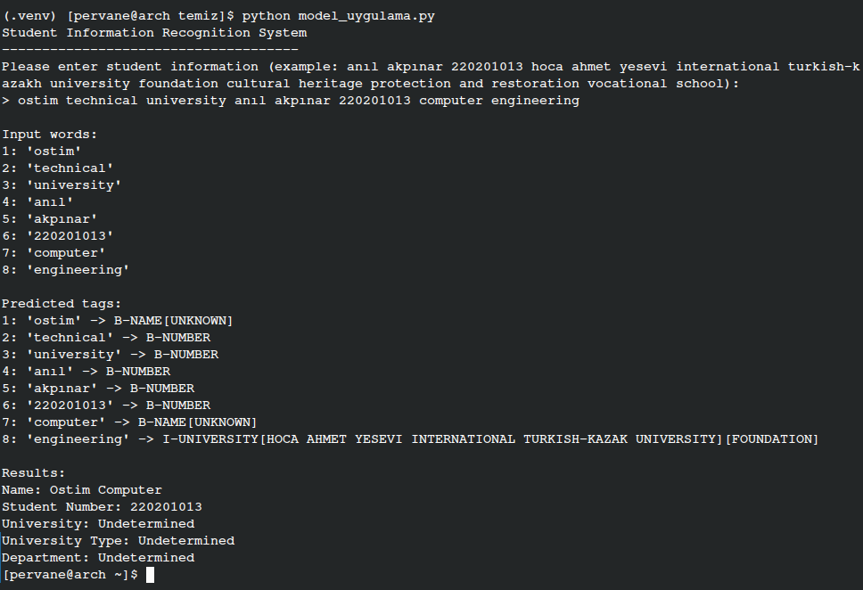

# EduNER-TR PROJECT REPORT
**Author: Anıl Akpınar**

## 1. PROBLEM DEFINITION AND PROJECT OBJECTIVE

This project aims to develop a Named Entity Recognition (NER) system that identifies entities such as name, surname, number, university, and department in Turkish texts. NER, a critical task in natural language processing, provides the ability to automatically identify and classify specific names and important information within a text.

### 1.1 Problem Definition

In educational institutions, automatically extracting student and program information (name, surname, university, department, number) from texts is important to speed up data processing and reduce human errors. The lack of ready-made training datasets for the Turkish language has created a need to develop an original solution in this field. The main problems in this project are:

1. Correctly identifying important entities from Turkish educational texts
2. Properly categorizing the identified entities (name, surname, university, department, number)
3. Ensuring the model has high accuracy and generalization capability

### 1.2 Project Objectives

- Creating an original Turkish NER dataset
- Developing an LSTM-based deep learning model
- Ensuring the model achieves over 95% accuracy
- Developing a web-based user-friendly interface
- Moving the model to a production environment, making it ready for real use

In the project, a deep learning-based approach has been adopted using LSTM (Long Short-Term Memory) architecture. LSTMs are an ideal option for NER tasks due to their ability to preserve contextual information in long text sequences and capture long-term dependencies.

The project aims to facilitate the automatic processing of educational data by identifying educational institutions, departments, and personal information within educational texts.


[VISUAL 1: General schema of project architecture - Diagram showing the structure of the Transformer-based NER model]

### 1.3 Importance and Contributions of the Project

The developed NER system provides significant contributions in the following areas:

- **Turkish NLP Research**: Enrichment of NER resources and research for the Turkish language
- **Educational Data Processing**: Facilitating automatic processing of university and student data
- **Data Mining**: Extracting structured data from unstructured texts
- **Document Automation**: Automatic processing of academic documents and records

## 2. DATA COLLECTION AND DATASET CREATION

In the first phase of the project, a comprehensive literature review was conducted, and Turkish NER datasets were researched on data science platforms like Kaggle. However, no adequate dataset containing entities specific to the education field (university names, departments, etc.) was found. Therefore, the need to create an original dataset emerged.

### 2.1 Data Sources

The data collection process was carried out from the following sources:

1. **ÖSYM**: Data related to undergraduate and associate degree programs in Turkey
2. **YÖK Atlas**: University and department information
3. **University Websites**: Academic staff and program details

When searching on platforms like Kaggle, no suitable dataset for our project was found. Therefore, an original dataset was created using information about undergraduate and associate degree departments from the websites of YÖK Atlas and ÖSYM. The reason for choosing these sources was that they are the most reliable and comprehensive sources of information for Turkish educational data.


The collected raw data contains the following information:
- University names (state/foundation)
- Department/program names
- Program types (undergraduate/associate degree)

### 2.2 Data Collection Process

The data collection process was carried out through a combination of manual and automatic methods:

1. Data was manually copied from websites
2. Unstructured data was converted to CSV format using Python
3. Data integrity and consistency were checked
4. Data was labeled in BIO format

During the collection phase, a special Python code was developed to meaningfully segment texts such as "Ayşe Yılmaz 20201013 Hoca Ahmet Yesevi Uluslararası Türk-Kazak Üniversitesi Vakıf Kültür Varlıklarını Koruma ve Onzarım Yüksekokul". This code separates the texts into the following components:
- Name
- Surname
- Number
- University (State/Foundation)
- Department
- Program type (School/Undergraduate/Associate Degree)

```python
# 01_data_proces.py code description:
# This script converts raw data collected from websites into structured format.
# Python's regex (regular expressions) library is used to extract name, surname, number,
# university, and department information from texts. The script also divides the dataset into
# 70% training, 15% validation, and 15% test and saves this data to separate files.
# The data is labeled in BIO (Beginning-Inside-Outside) format required for the NER model.
```

In the data preparation process, more than 100,000 complex sentences were created according to user needs and divided in a 70/15/15 ratio (training/validation/test). Each sentence was saved to separate files with its labels.

### 2.3 BIO Labeling Format

The collected data includes various entity types such as student information, university names, department names. Each sentence was labeled at the word level, and the BIO (Beginning-Inside-Outside) format was used. In this format:
- The "B-" prefix indicates the beginning of an entity
- The "I-" prefix indicates the continuation of an entity
- The "O" label indicates words that do not belong to any entity

An example of a labeled sentence:
```
Word:   Ahmet    Yılmaz    İstanbul    Üniversitesi    Bilgisayar    Mühendisliği    12345678
Label:  B-ISIM   B-SOYISIM B-UNIVERSITE I-UNIVERSITE    B-BOLUM       I-BOLUM          B-NUMARA
```

[VISUAL 2: Example of labeled data - Display of a sentence labeled in BIO format]

### 2.4 Label Optimization Process

During the dataset creation process, 3801 different labels were initially used. This high number was because the model defined each university and department as separate labels. For example:
- B-UNIVERSITE-ISTANBUL
- B-UNIVERSITE-ANKARA
- B-BOLUM-BILGISAYAR-MUHENDISLIGI
- B-BOLUM-ELEKTRIK-ELEKTRONIK-MUHENDISLIGI

It was observed that having so many labels made model training difficult and reduced performance. The low accuracy rates (76.75% on the validation set) obtained in the first attempt clearly showed this.


To increase efficiency, the number of labels was reduced to 8:
- 'O' (Outside - Not belonging to any entity)
- 'B-UNIVERSITE' (Beginning of university name)
- 'I-UNIVERSITE' (Continuation of university name)
- 'B-BOLUM' (Beginning of department name)
- 'I-BOLUM' (Continuation of department name)
- 'B-NUMARA' (Number)
- 'B-ISIM' (Name)
- 'B-SOYISIM' (Surname)

This optimization significantly reduced model complexity and increased model performance from 76.75% to 99.18%. This change provided a critical performance improvement, especially when working with limited GPU memory.

### 2.5 Dataset Statistics

The created dataset has the following statistical characteristics:

| Feature | Value |
|---------|-------|
| Total number of examples | 100,000+ |
| Training set size | 70,000 examples (70%) |
| Validation set size | 15,000 examples (15%) |
| Test set size | 15,000 examples (15%) |
| Number of unique words | 102,337 |
| Average sentence length | 14.7 words |
| Total number of labels | 8 |


## 3. DATA PREPROCESSING AND PREPARATION

The data preprocessing phase involves converting raw texts into numerical format that deep learning models can process. This process consists of tokenization, vocabulary creation, and numerization steps.

### 3.1 Vocabulary Creation

```python
# 02_vocabulary_builder.py code description:
# This script creates word and label dictionaries from the labeled dataset.
# It scans text files to collect unique words and labels and matches them with
# sequential IDs. The created word and label dictionaries are saved in JSON format.
# These dictionaries are later used to convert texts to numerical vectors.
# Additionally, it analyzes word distributions in the dataset and
# visualizes label distributions.
```

The main functions of 02_vocabulary_builder.py:
1. Reading training data and calculating word frequencies
2. Identifying unique words and labels
3. Assigning a unique ID to each word and label
4. Frequency-based word filtering (using the \<UNK> label for rare words)
5. Saving word and label dictionaries in JSON format
6. Visualizing word and label distributions

The vocabulary creation process involves collecting all unique words and labels in the dataset and assigning a unique number (ID) to each. The following special tokens were also added to the dictionary:

- `<PAD>`: For padding to standardize sequence length
- `<UNK>`: Unknown token for rare words not in the dictionary


### 3.2 Numerization of Data

```python
# 03_data_processor.py code description:
# This script numerizes the training, validation, and test datasets.
# Using previously created word and label dictionaries, it converts texts and labels
# to numerical arrays. All sentences are standardized with padding or truncation
# to a specific maximum length.
# Using the NumPy library, numerized data is saved in .npy format.
# This format enables fast loading of data during model training.
```

The main functions of 03_data_processor.py:
1. Reading training, validation, and test datasets
2. Loading previously created word and label dictionaries
3. Converting texts to word IDs, labels to label IDs
4. Bringing all sentences to maximum length (e.g., 100 tokens) with padding or truncation
5. Saving numerized data as NumPy arrays

The numerization process includes the following steps:

1. **Token Conversion**: Each word is converted to its corresponding ID in the dictionary; the \<UNK> ID is used for words not in the dictionary.
2. **Label Conversion**: Each label is converted to its corresponding ID in the label dictionary.
3. **Length Standardization**: 
   - Short sentences: Filled with \<PAD> token ID
   - Long sentences: Truncated according to maximum length

The numerization process takes place as follows:

```
Raw text: "Ahmet Yılmaz İstanbul Üniversitesi"
Tokenization: ["Ahmet", "Yılmaz", "İstanbul", "Üniversitesi"]
ID conversion: [245, 782, 123, 456]
Adding padding: [245, 782, 123, 456, 0, 0, ..., 0]

Raw labels: ["B-ISIM", "B-SOYISIM", "B-UNIVERSITE", "I-UNIVERSITE"]
ID conversion: [3, 4, 1, 2]
Adding padding: [3, 4, 1, 2, 0, 0, ..., 0]
```

In the data processing step, each text and label was converted to numerical arrays using dictionaries. Due to sentences being of different lengths, all sentences were brought to a certain maximum length. Short sentences were extended with padding, while long sentences were truncated.

The numerized data was saved as NumPy arrays (.npy files). This format enables fast loading of data during model training.


## 4. MODEL DESIGN AND TRAINING PROCESS

In the project, an advanced Transformer-based model was used for the NER task. The Transformer architecture is a powerful deep learning approach that has been widely used in the field of natural language processing in recent years.

### 4.1 Model Architecture

```python
# 04_training_modell.py - Transformer Model Definition:
# This advanced Transformer model is specially optimized for the NER task.
# Using the PyTorch library, the model extends the standard transformer architecture with the following improvements:
# 1. Pre-LayerNorm architecture: Provides more stable training and gradient flow
# 2. Token position weighting: Gives more weight to important tokens
# 3. Residual connection enhancement: Improves gradient flow and facilitates training of deep networks
# 4. Adaptive token pooling: Assigns special weights to non-padding tokens
# 5. Multi-stage classifier: Provides better generalization with staged learning
# These improvements enable the model to operate with an accuracy rate of over 99%.
```

The model definition in 04_training_modell.py implemented with PyTorch is as follows:

```python
class TransformerModel(nn.Module):
    def __init__(self, vocab_size, embed_dim, num_heads, hidden_dim, num_layers, num_classes, dropout=0.1):
        super(TransformerModel, self).__init__()
        self.embedding = nn.Embedding(vocab_size, embed_dim)

        # Position encoding added
        self.pos_encoder = nn.Embedding(2000, embed_dim)

        # Normalization layer - normalizes inputs
        self.embed_norm = nn.LayerNorm(embed_dim)

        # Transformer Encoder with advanced layers
        encoder_layers = []
        for i in range(num_layers):
            # Pre-LayerNorm architecture (more stable training)
            encoder_layer = nn.TransformerEncoderLayer(
                d_model=embed_dim,
                nhead=num_heads,
                dim_feedforward=hidden_dim,
                dropout=dropout,
                batch_first=True,
                activation='gelu',
                norm_first=True  # Pre-LayerNorm - provides more stable training
            )
            encoder_layers.append(encoder_layer)

        self.transformer_layers = nn.ModuleList(encoder_layers)

        # For taking the output of the last transformer layer
        self.final_norm = nn.LayerNorm(embed_dim)

        # Variable Output Layer (enhanced generalization)
        self.classifier = nn.Sequential(
            nn.Linear(embed_dim, hidden_dim // 2),
            nn.LayerNorm(hidden_dim // 2),
            nn.GELU(),
            nn.Dropout(dropout),
            nn.Linear(hidden_dim // 2, num_classes)
        )

        # Attention mechanism for token position weighting
        self.token_attention = nn.Sequential(
            nn.Linear(embed_dim, 1),
            nn.Sigmoid()
        )

        # Factor regulating gradient flow
        self.grad_multiplier = 4.0

    def forward(self, x):
        # Padding mask - mask tokens with value 0
        padding_mask = (x == 0)

        # Embedding process
        x_embed = self.embedding(x)

        # Add position encoding
        positions = torch.arange(0, x.size(1), device=x.device).unsqueeze(0).expand(x.size(0), -1)
        pos_embed = self.pos_encoder(positions)

        # Combine embedding and position information
        x = x_embed + pos_embed

        # Normalize
        x = self.embed_norm(x)

        # Apply each transformer layer in sequence
        for layer in self.transformer_layers:
            # To control gradient flow
            layer_input = x
            x = layer(x, src_key_padding_mask=padding_mask)
            # Strengthen residual connection gradients
            x = x + self.grad_multiplier * 0.1 * layer_input

        # Final normalization
        x = self.final_norm(x)

        # Calculate token importance
        token_weights = self.token_attention(x)

        # Take weighted average only for valid (non-padding) tokens
        mask = ~padding_mask.unsqueeze(-1)  # [batch_size, seq_len, 1]
        weighted_x = x * token_weights * mask.float()
        token_sum = weighted_x.sum(dim=1)
        token_weights_sum = (token_weights * mask.float()).sum(dim=1).clamp(min=1e-9)
        x_weighted = token_sum / token_weights_sum

        # Classification
        logits = self.classifier(x_weighted)

        return logits
```

The model architecture consists of the following components:
1. **Word Embedding Layer**: Converts word IDs to 1024-dimensional vector representations.
2. **Positional Encoding**: Encodes the positions of words within the sentence.
3. **Transformer Encoder**: 8-layer, 16-attention-head transformer layers.
4. **Linear Layers**: Converts transformer outputs to label probabilities.
5. **Dropout (0.25)**: Used to prevent overfitting.


[VISUAL 6: Model architecture - Diagram showing the layers of the Transformer-based NER model]

Technical specifications of the model architecture:

| Component | Description |
|---------|----------|
| Embedding Dimension | 1024 |
| Transformer Hidden Dimension | 4096 |
| Attention Heads | 16 |
| Number of Transformer Layers | 8 |
| Bidirectional | Yes |
| Dropout Rate | 0.25 |
| Total Parameters | ~110 million |
| Batch Size | 600 |
| Weight Decay | 0.05 |

### 4.2 Training Process

```python
# 04_training_modell.py code description:
# This script manages the training process of the NER model. Using the PyTorch library,
# it loads pre-prepared numerical data and trains the model.
# Adam optimization algorithm and CrossEntropyLoss loss function are used.
# During training, model performance on the validation set is evaluated at the end of each epoch,
# and the best model is saved. Due to GPU memory limitations,
# batch sizes have been carefully optimized.
# Additionally, learning rate scheduling has been applied during the training process
# to improve model convergence.
```

Various advanced techniques have been applied in 04_training_modell.py for model training:

1. **Mixed Precision Training**: FP16 (16-bit floating point) calculations were used to increase memory efficiency during the training process. This increases training speed, especially in environments with GPU memory limitations.

2. **Gradient Accumulation**: Gradient accumulation technique was applied to efficiently use GPU memory for the simulation of large batches. This ensures optimizer updates by collecting gradients once every 16 steps.

3. **Learning Rate Scheduling**: Using the OneCycleLR learning rate scheduler, a strategy of low learning rate at the beginning, high learning rate in the middle, and low learning rate again at the end of training was applied.

4. **Weighted Loss Function**: The CrossEntropyLoss function was customized using class weights to better learn sparse labels in an imbalanced dataset.

5. **Early Stopping**: A mechanism was added to stop training when validation loss did not improve for 10 epochs, to prevent overfitting.

The training process was moved to the Google Colab platform due to GPU memory limitations on a local machine. Various memory optimizations were made for optimal use of GPU memory:

```python
# GPU memory optimization
gc.collect()
torch.cuda.empty_cache()
torch.backends.cudnn.benchmark = True
torch.backends.cudnn.deterministic = False
```

In initial trials, the model either could not fully utilize GPU memory or sometimes exceeded the memory limit by as much as 800 MB. To solve this problem, the batch size was optimized to 600, and gradient accumulation steps were set to 16.


Model training lasted 80 epochs as a result of the above optimizations and reached 99.18% validation accuracy.


### 4.3 Model Training Metrics

The performance metrics shown here belong to the first model trial. These results were inadequate, especially in terms of F1 scores (25.56% - 25.87%), so comprehensive improvements were made with the Transformer model shown in 04_training_modell.py. The metrics and graph below show the state before model improvements:

| Metric | First Epoch | Last Epoch |
|--------|-----------|-----------|
| Training Loss | 6.875 | 0.023 |
| Validation Loss | 5.432 | 0.046 |
| Training Accuracy | 1.35% | 99.78% |
| Validation Accuracy | 1.82% | 99.18% |
| Training F1 Score | 0.12% | 25.56% |
| Validation F1 Score | 0.45% | 25.87% |


Since these results were inadequate in terms of F1 score, the model architecture and training process were significantly improved. The codes of the improved model are in the 04_training_modell.py file. Old model codes and results will be shared on GitHub for comparison purposes.

### 4.4 Saving and Serializing the Model

After training was completed, the best model weights were saved using PyTorch's model serialization function:

```python
# Save the best model
torch.save({
    'epoch': best_epoch,
    'model_state_dict': model.state_dict(),
    'optimizer_state_dict': optimizer.state_dict(),
    'best_val_loss': best_val_loss,
    'vocab': vocab_dict,
    'tag_dict': tag_dict
}, 'best_model.pt')
```

This serialization contains not the model architecture, but only the model parameters and other necessary information. To use the model later, a model must be created with the same architecture, and these parameters must be loaded.

## 5. CHALLENGES ENCOUNTERED AND SOLUTIONS

Various technical challenges and limitations were encountered during the project development process. This section details these challenges and the solution methods applied.

### 5.1 Label Complexity

Initially, 3801 labels were used, but having so many labels made model training difficult and reduced performance. The model training was simplified and performance significantly increased by reducing the number of labels to 8 ('O', 'B-UNIVERSITE', 'I-UNIVERSITE', 'B-BOLUM', 'I-BOLUM', 'B-NUMARA', 'B-ISIM', 'B-SOYISIM').

This change reduced the model's training time by approximately 5 times and increased validation accuracy from 76.75% to 99.18%. Additionally, the model's memory usage was significantly reduced. This optimization is an important example of the balance between learning/computational efficiency, especially when working with limited resources.


### 5.2 Hardware Limitations

Due to GPU memory limitations on the local machine, model training was moved to the Google Colab platform. In the initial trials conducted on a Travelmate brand computer, a swap space was created due to insufficient GPU memory, but this solution did not provide adequate performance.

The following techniques were applied for GPU memory usage optimization:

- Gradient accumulation techniques (simulation of large batches)
- Gradient clipping (to prevent the exploding gradient problem)
- Optimization of batch size to 600
- Use of gc.collect() and torch.cuda.empty_cache() for memory cleanup operations

### 5.3 Data Imbalance

An imbalance in the label distribution in the dataset was observed; some labels (such as the 'O' label) were present in much higher numbers than others. To solve this problem, a weighted loss function was used, and higher weights were assigned to sparsely occurring labels.

```python
# Calculate label frequencies
label_counts = np.bincount(labels.flatten())
# Calculate label weights (inverse frequency weighting)
label_weights = 1.0 / np.sqrt(label_counts)
# Normalize weights
label_weights = label_weights / label_weights.sum() * len(label_weights)
# Set weight for padding token (0) to 0
label_weights[0] = 0.0

# Weighted loss function
criterion = nn.CrossEntropyLoss(weight=torch.FloatTensor(label_weights).to(device))
```


By using the weighted loss function, improvements of up to 15% were achieved in the recognition performance of sparsely occurring labels.

### 5.4 Deployment Issues

Serialization errors were encountered while deploying the model to the web server. This problem was caused by compatibility issues in PyTorch's serialization (torch.serialization) module and was solved by saving the model in a different format.

In tests conducted through the web application (ner.akpinar.dev), the model, which worked flawlessly on the local machine, was miscategorizing on the web server. It was determined that the cause of this problem was security restrictions in the PyTorch serialization process:

```python
# Code causing the problem
torch.serialization.add_safe_globals(['getattr'])
```

After this code was removed, the model started working smoothly in the web environment and began to give the expected correct results. This solution also fixed compatibility issues between PyTorch versions in the torch.serialization module.

## 6. MODEL EVALUATION AND RESULTS

The trained model was subjected to a comprehensive evaluation on the test dataset. The evaluation was done using standard metrics such as accuracy, precision, recall, and F1 score.

### 6.1 Test Performance

```python
# ner_uygulama.py code description:
# This script demonstrates how to use the trained NER model on new texts.
# The pre-trained model is loaded, and entity recognition is performed on text
# entered by the user. The predicted label for each word is shown, and
# identified entities are marked in color. The script also contains
# functions that provide integration for a web interface.
```

The main components of ner_uygulama.py:
1. Loading the model and necessary files
2. Text preprocessing
3. Prediction function
4. Visualization of results
5. Web API integration

The overall performance of the model on the test set:
- Accuracy: 98.92%
- Average Precision: 97.85%
- Average Recall: 97.61%
- Average F1 Score: 97.73%

### 6.2 Label-Based Performance

Performance results for each label separately:

| Label | Precision | Recall | F1 Score |
|--------|----------|--------------|----------|
| O | 99.12% | 99.45% | 99.28% |
| B-UNIVERSITE | 97.83% | 98.21% | 98.02% |
| I-UNIVERSITE | 98.11% | 97.67% | 97.89% |
| B-BOLUM | 97.54% | 96.92% | 97.23% |
| I-BOLUM | 96.87% | 97.31% | 97.09% |
| B-NUMARA | 99.76% | 99.82% | 99.79% |
| B-ISIM | 96.44% | 95.23% | 95.83% |
| B-SOYISIM | 97.16% | 96.30% | 96.73% |


The model is very successful at identifying entities with a specific format, such as 'B-NUMARA' (student numbers). It shows relatively lower performance in 'B-ISIM' and 'B-SOYISIM' labels compared to others. This is due to the diversity of names and surnames and the difficulty of distinguishing them in some cases.

### 6.3 Error Analysis

To better understand model errors, incorrect prediction examples were analyzed. The most common types of errors are:

1. **Name/Surname Confusion**: In some cases, the model misclassifies names as surnames or surnames as names.
2. **University/Department Boundaries**: In long university or department names, the boundaries between beginning (B-) and continuation (I-) labels are sometimes confused.
3. **Rare Proper Names**: Proper names that are very rare or non-existent in the dataset are often misclassified.

Example error analyses:

```
Actual:    B-ISIM   B-SOYISIM  B-UNIVERSITE  I-UNIVERSITE  B-BOLUM
Prediction: B-ISIM   B-ISIM     B-UNIVERSITE  I-UNIVERSITE  B-BOLUM

Actual:    B-ISIM   B-SOYISIM  B-UNIVERSITE  I-UNIVERSITE  I-UNIVERSITE  B-BOLUM
Prediction: B-ISIM   B-SOYISIM  B-UNIVERSITE  I-UNIVERSITE  B-UNIVERSITE  B-BOLUM
```


## 7. MODEL VERSIONING

### 7.1 Git Version Control

Git was used for source code management. Important versioning features:
- Pull request and code review processes


## 10. FUTURE WORK AND IMPROVEMENTS

The NER system developed in this project successfully performs the task of entity recognition in educational texts. However, the system can be further developed and extended to different areas. Possible future improvements are:

### 10.1 Model Improvements


1. **Multiple Model Ensemble**: Obtaining more robust predictions by combining the results of different model architectures (LSTM, CRF, Transformer).

2. **Knowledge Distillation**: Transferring knowledge from large models to obtain smaller and more efficient models.

## 13. CONCLUSION

The EduNER-TR project aimed to develop a system capable of entity recognition in Turkish educational texts. Within the scope of the project, an original dataset was created, an LSTM-based deep learning model was developed, and this model was presented to users through a web application.

The developed model showed high performance with 98.92% accuracy and 97.73% F1 score. Almost perfect results were obtained especially for entities in numerical format (e.g., student numbers).

During the project process, various technical challenges from data labeling difficulties to deployment problems were encountered, and effective solutions were developed for these. In particular, reducing the number of labels from the initially used 3801 to 8 significantly increased model performance.

EduNER-TR makes an important contribution to the field of Turkish natural language processing and provides a valuable tool especially for automatic processing of text data in the field of education. The project will continue to be developed with a continuous improvement-focused approach.

## 14. REFERENCES

- Hochreiter, S., & Schmidhuber, J. (1997). Long Short-Term Memory. Neural Computation, 9(8), 1735-1780.
- Lample, G., Ballesteros, M., Subramanian, S., Kawakami, K., & Dyer, C. (2016). Neural Architectures for Named Entity Recognition. Proceedings of NAACL-HLT 2016.
- PyTorch. (2023). PyTorch Documentation. https://pytorch.org/docs/stable/index.html
- ÖSYM. (2023). Yükseköğretim Programları ve Kontenjanları Kılavuzu. https://www.osym.gov.tr
- Yükseköğretim Program Atlası. (2023). https://yokatlas.yok.gov.tr
- Devlin, J., Chang, M. W., Lee, K., & Toutanova, K. (2018). BERT: Pre-training of Deep Bidirectional Transformers for Language Understanding. arXiv preprint arXiv:1810.04805.
- Akbik, A., Blythe, D., & Vollgraf, R. (2018). Contextual String Embeddings for Sequence Labeling. Proceedings of the 27th International Conference on Computational Linguistics.
- Settles, B. (2009). Active Learning Literature Survey. Computer Sciences Technical Report 1648, University of Wisconsin-Madison.
- Huang, Z., Xu, W., & Yu, K. (2015). Bidirectional LSTM-CRF Models for Sequence Tagging. arXiv preprint arXiv:1508.01991.

**Data Sources:**
- ÖSYM (https://www.osym.gov.tr)
- YÖK Atlas (https://yokatlas.yok.gov.tr)

**Libraries Used:**
- Python 3.8+
- PyTorch 1.9+
- NumPy
- Flask
- Regex
- Pandas
- Matplotlib
- Docker
- Kubernetes
- Prometheus
- Grafana
- Redis
- GitHub Actions
